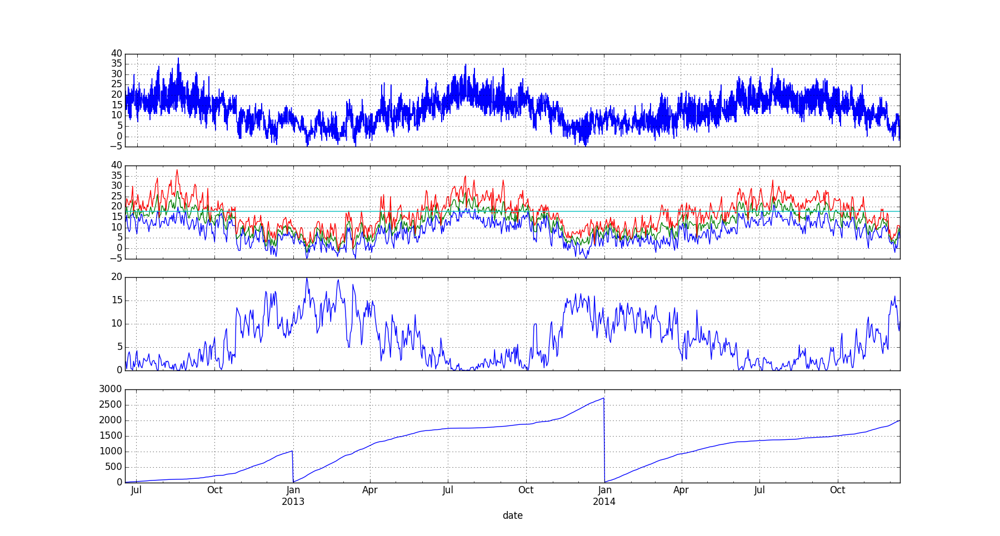

.. pandas_degreedays documentation master file, created by
   sphinx-quickstart on Sun Dec 21 18:06:29 2014.
   You can adapt this file completely to your liking, but it should at least
   contain the root `toctree` directive.

Welcome to pandas_degreedays's documentation!
=============================================

.. image:: https://pypip.in/version/pandas_degreedays/badge.svg
    :target: https://pypi.python.org/pypi/pandas_degreedays/
    :alt: Latest Version

.. image:: https://pypip.in/py_versions/pandas_degreedays/badge.svg
    :target: https://pypi.python.org/pypi/pandas_degreedays/
    :alt: Supported Python versions

.. image:: https://pypip.in/format/pandas_degreedays/badge.svg
    :target: https://pypi.python.org/pypi/pandas_degreedays/
    :alt: Download format

.. image:: https://pypip.in/license/pandas_degreedays/badge.svg
    :target: https://pypi.python.org/pypi/pandas_degreedays/
    :alt: License

.. image:: https://pypip.in/status/pandas_degreedays/badge.svg
    :target: https://pypi.python.org/pypi/pandas_degreedays/
    :alt: Development Status

.. image:: https://readthedocs.org/projects/pandas-degreedays/badge/?version=latest
   :target: http://pandas-degreedays.readthedocs.org/en/latest/
   :alt: Documentation Status

.. image:: https://sourcegraph.com/api/repos/github.com/scls19fr/pandas_degreedays/.badges/status.png
   :target: https://sourcegraph.com/github.com/scls19fr/pandas_degreedays

.. image:: https://badges.gitter.im/Join%20Chat.svg
   :target: https://gitter.im/scls19fr/pandas_degreedays?utm_source=badge&utm_medium=badge&utm_campaign=pr-badge&utm_content=badge

.. image:: https://travis-ci.org/scls19fr/pandas_degreedays.svg?branch=master
    :target: https://travis-ci.org/scls19fr/pandas_degreedays

Contents:

.. toctree::
   :maxdepth: 2

pandas\_degreedays
==================

Pandas Degree Days (``pandas_degreedays``) is a `Python <https://www.python.org/>`__ package to
calculate `degree days <http://en.wikipedia.org/wiki/Degree_day>`__.

Usage
-----

You must provide a `Pandas
Series <http://pandas.pydata.org/pandas-docs/stable/generated/pandas.Series.html>`__
with temperature values.

Let's call ``ts_temp`` this Serie which looks like:

::

    datetime
    2014-03-20 23:00:00    11
    2014-03-20 23:30:00    11
    2014-03-21 00:00:00    11
    2014-03-21 00:30:00    11
    2014-03-21 01:00:00    11
    2014-03-21 01:30:00    11
    ...
    2014-11-01 20:00:00    12
    2014-11-01 20:30:00    12
    2014-11-01 21:00:00    12
    2014-11-01 21:30:00    12
    2014-11-01 22:00:00    12
    2014-11-01 22:30:00    12
    Name: temp, Length: 10757

You can get a time serie with temperature in ``sample`` folder and read
it using:

::

    import pandas as pd
    filename = 'temperature_sample.xls'
    df_temp = pd.read_excel(filename)
    df_temp = df_temp.set_index('datetime')
    ts_temp = df_temp['temp']

You can also fetch a time serie with temperature from `OpenWeatherMap.org <http://www.openweathermap.org/>`__.
You need to install first `openweathermap_requests <http://openweathermap-requests.readthedocs.org/>`__.

::

    import logging
    logger = logging.getLogger()
    logger.setLevel(logging.DEBUG)
    from pandas_degreedays.provider import TemperatureProvider
    ts_temp = TemperatureProvider('OpenWeatherMap', api_key='').get_from_coordinates(0.34189, 46.5798114, '20120601', '20141215')

We can see if some data are missing using:

::

    idx = ts_temp.index
    s_idx = pd.Series(idx, index=idx)
    diff_idx = s_idx-s_idx.shift(1)
    s_sampling_period = diff_idx.value_counts()
    sampling_period = s_sampling_period.index[0] # most prevalent sampling period
    not_sampling_period = (diff_idx != sampling_period) # True / False

We can interpolate linearly missing data using:

::

    from pandas_degreedays import inter_lin_nan 
    ts_temp = inter_lin_nan(ts_temp, '1H') # interpolates linearly NaN

We can calculate degree days using:

::

    from pandas_degreedays import calculate_dd
    df_degreedays = calculate_dd(ts_temp, method='pro', typ='heating', Tref=18.0, group='yearly')

``method`` can be :
 - ``'pro'`` (energy professionals) - this is default calculation method
 - ``'meteo'``

``typ`` (calculation type) can be :
 - ``'heating'`` - this is default calculation type
 - ``'cooling'``

``Tref`` is reference temperature - default value is ``18.0``

``group`` can be :
 - ``'yearly'`` - this is default grouping option
 - ``'monthly'``
 - ``'weekly'``
 - ``None``

It outputs a `Pandas
DataFrame <http://pandas.pydata.org/pandas-docs/stable/generated/pandas.DataFrame.html>`__
with degree days like:

::

                Tmin  Tmax   Tavg  Tref         DD      DD_cum
    2014-03-22   7.0  11.0   9.00    18   9.000000    9.000000
    2014-03-23   3.0  12.0   7.50    18  10.500000   19.500000
    2014-03-24   0.0  10.0   5.00    18  13.000000   32.500000
    2014-03-25   6.0  10.0   8.00    18  10.000000   42.500000
    2014-03-26   5.0  12.0   8.50    18   9.500000   52.000000
    2014-03-27   2.0   8.0   5.00    18  13.000000   65.000000
    ...          ...   ...    ...   ...        ...         ...
    2014-10-26   5.0  17.0  11.00    18   7.000000  653.547663
    2014-10-27   9.0  22.0  15.50    18   3.336923  656.884586
    2014-10-28   7.5  20.0  13.75    18   4.544400  661.428986
    2014-10-29   8.0  19.0  13.50    18   4.618182  666.047168
    2014-10-30  12.0  22.0  17.00    18   1.992000  668.039168
    2014-10-31  11.0  24.0  17.50    18   2.143077  670.182245

    [224 rows x 6 columns]

You can display plot using:

::

    from pandas_degreedays import plot_temp
    plot_temp(ts_temp, df_degreedays)

About Pandas
------------

`pandas <http://pandas.pydata.org/>`__ is a Python package providing
fast, flexible, and expressive data structures designed to make working
with "relational" or "labeled" data both easy and intuitive. It's a very
convenient library to work with time series.

Links
-----

- Documentation can be found at `Read The Docs <http://pandas-degreedays.readthedocs.org/>`__ ;
- Source code and issue tracking can be found at `GitHub <https://github.com/scls19fr/pandas_degreedays>`__.

Indices and tables
==================

* :ref:`genindex`
* :ref:`modindex`
* :ref:`search`

